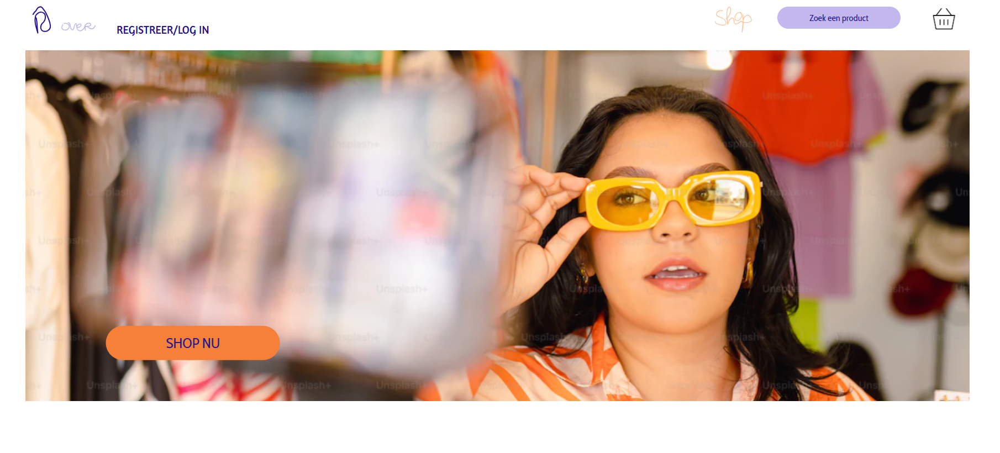
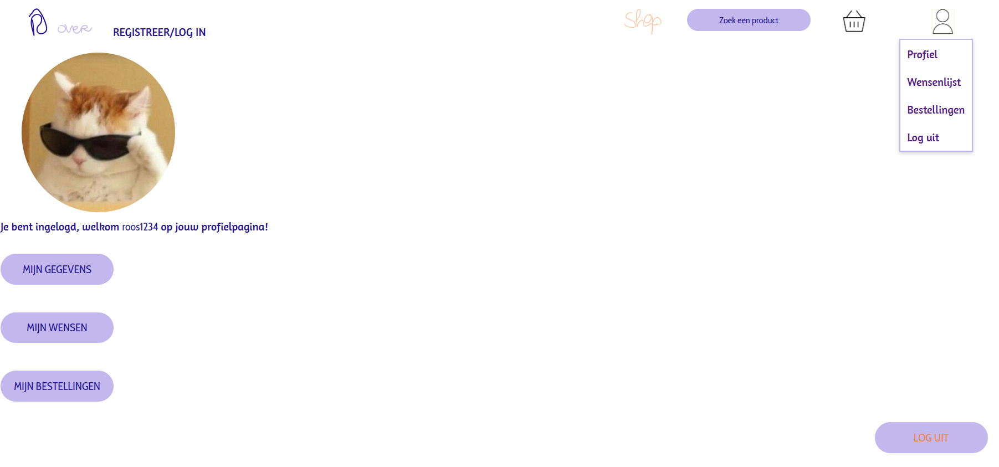
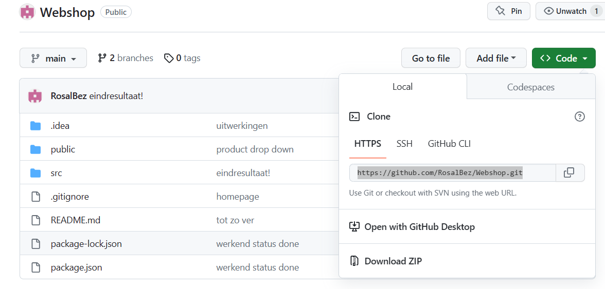

**RSL-webshop** 
Eindopdracht NOVI Hogeschool Leerlijn Frontend

**Inleiding**

Een vriendin van mij maakt sieraden en mij werd gevraagd om daar een webshop voor te bouwen. 
Deze app. is het begin van een nieuwe bedrijf! Vanaf nu koop je al jouw handgemaakte sieraden bij RSL-webshop! 
En wees gewaarschuwd, er zal nog veel meer handgemaakt goed bijkomen!

**Inhoud**
- screenshots van de belangrijkste pagina's
- Technische benodigdheden
- Api's binnen de applicatie
- Installatie handleiding
- Extra: korte gebruikershandleiding

**Screenshot van de homepage**

**Screenshot profielpagina (beschikbaar ná registreren en inloggen)**

**Technische benodigdheden**

Voor het runnen van deze webapplicatie is het volgende nodig:
- Webstorm (of vergelijkbare IDE)
- NodeJs

_Heb je nog geen NodeJs? 
Installeer die dan hier: [NodeJS](https://nodejs.org/en)_

**API's binnen de applicatie**

Er is gebruik gemaakt van de volgende Back-end API:
- https://github.com/hogeschoolnovi/novi-educational-backend-documentation  (NOVI BACKEND), die draait op een Heroku server (https://frontend-educational-backend.herokuapp.com/)

En voor de producten in de winkel en de bijbehorende functionaliteiten is er gebruik gemaakt van de Fake Store Api: 
- https://fakestoreapi.com/docs

**Installatie handleiding**

De link die je hebt ontvangen stuurt je naar een GitHub project, dit project dien je te clonen naar jouw lokale machine. Druk rechts boven op de groene knop 'code' om de projectcode te kopieren.

- Open jouw IDE (bijv. webstorm) en kies N*ew > Project from Version Control* en voeg hier de gekopieerde code van het GitHub project in. Je hebt nu het project gecloned!
-Check nu eerst of NodeJS juist geinstalleerd is op jouw machine door het volgende commando in de terminal in te typen:
  
      node -v
  
Als de terminal een antwoord geeft, bijvoorbeeld: v18.x.y, dan is NodeJS correct geïnstalleerd.

- Installeer nu alle dependencies door het volgende commando in de terminal te runnen:

    _npm install_

Wanneer dit klaar is, kun je de applicatie starten met behulp van:

    _npm run start_

Als het goed is opent zich nu automatisch een webbrowers op je localhost(vaak:3000)

Je kunt nu de webapplicatie bekijken en gebruiken!

**Extra: korte gebruikershandleiding**

Dit project is met veel liefde in elkaar gezet en behelst meer dan het gevraagd aantal pagina's. Hier is daarom een korte uitleg over de pagina's/de routing in de applicatie

De applicatie bestaat op 5 hoofdpaginas
- Home
- Over
- Registreer/log in
- Shop (overzicht met alle producten)
- Winkelmandje (een functie die helaas nog niet werkt)

Onder Shop bevinden zich 3 sub-paginas
- Armbanden
- Kettingen
- Brilkoorden

Elk product bevat een foto waar je op kunt klikken dit brengt je naar de detailpagina van dat product.

Via de pagina 'Registreer en Log in' kun je een account aanmaken. Die geeft je vervolgens toegang tot de volgeden extra paginas
- profiel
- gegevens
- wensenlijst (een functie die helaas nog niet werkt)
- bestellingen (een functie die helaas nog niet werkt)

De navigatiebalk en de footer zijn op elke pagina bereikbaar en heeft clickable functies (waaronder de zoekbalk functie)

